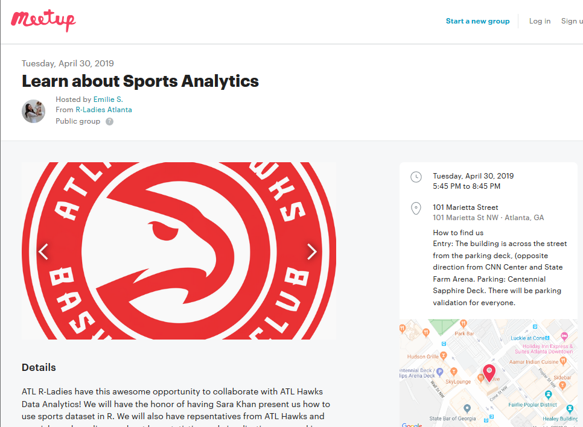
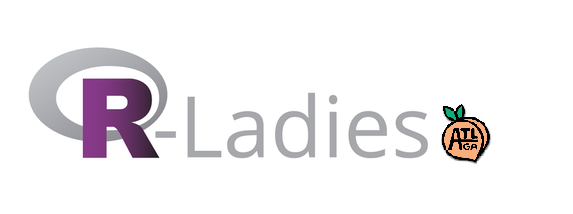
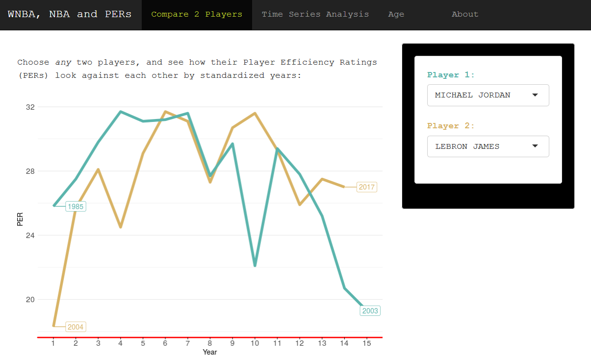
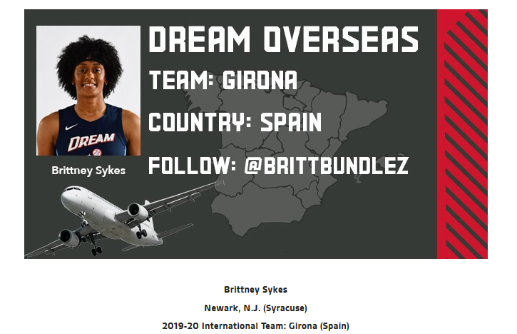
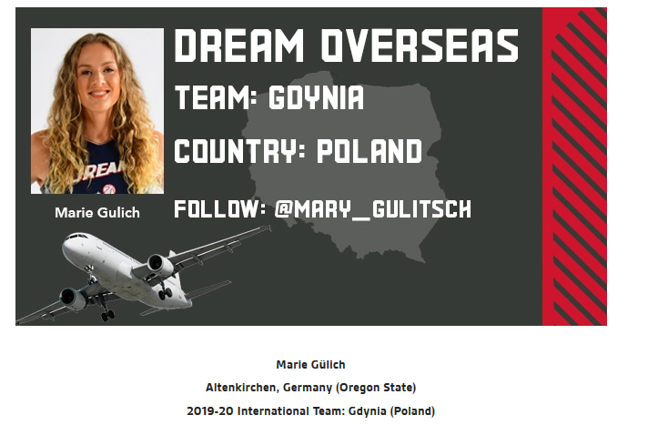

```{r setup, include=FALSE}
options(htmltools.dir.version = FALSE)
```

```{r, echo=F, eval=T, warning=F, message=F}
library(tidyverse)
```
---
# Who Am I?

--

- Masters in Public Health Informatics...

--

- Consultant at Gorman Consulting

--

- Adjunct at Rollins School of Public Health, Dept. of Biostatistics

--

- **Clearly not working in Sports Analytics**

---
class: inverse, center, middle

# Why this talk?


---

# May 2019 


Step back to May 2019. Invited as the **R Ladies of Atlanta** guest speaker for the Atlanta Hawks.


```{r, echo=F, out.width = "600px"}



```


---


# What is the **R Ladies of Atlanta** group?




*Mission statement:* The R community suffers from an underrepresentation of minority genders (including but not limited to cis/trans women, trans men, non-binary, genderqueer, agender) in every role and area of participation, whether as leaders, package developers, conference speakers, conference participants, educators, or users (see recent stats).

As a diversity initiative, the mission of R-Ladies is to achieve proportionate representation by encouraging, inspiring, and empowering people of genders currently underrepresented in the R community. R-Ladies’ primary focus, therefore, is on supporting minority gender R enthusiasts to achieve their programming potential, by building a collaborative global network of R leaders, mentors, learners, and developers to facilitate individual and collective progress worldwide.

---

# R-Ladies directory

World-wide organization - *280* chapters
   


```{r eval=require('DT'), tidy=T, echo = F}

DT::datatable(
  read.csv("data/Current-Chapters.csv") %>% sample_n(10) %>% select(1:3,15),
  fillContainer = FALSE, options = list(
      pageLength = 200,
      dom = "ti",
      ordering = FALSE
    ),
    height = 600
)
```


---
class: inverse, center, middle

# May 2019: ATL Hawks + R Ladies


---

# The dashboard


https://skhan22.shinyapps.io/RLadies_Hawks/ 


Made using R Shiny

```{r, echo=F, out.width = "400px"}

knitr::include_graphics("pics/shiny-logo.png")

```


---

# What is in the dashboard?

--

- Extensible tool to compare standardized PERs across years and seasons contributed by players, regardless of years played or team (or gender-structured organization)

<br>

--

- To analyze WNBA player scores with those in the NBA

<br>

--

- To look at long career vs short career players

<br>

---

# The data:

Uses **Player Efficency Ratings** (PERs) 

--

What are PERs?

--

**PERs**: average contribution of a player for each season
**Data source**: https://www.basketball-reference.com/

```{r, echo=F, out.width = "400px"}



```


---

# What motivated incorporating WNBA?


--

1. RLadies!


--

##**2. Not a lot of data on WNBA available online**

- Had to manually scrape each data point (friend of a friend had done this previously) from _Wikipedia_

- Lack of data analysis on WNBA

--

- Surprisingly, no comparison of PERs between NBA and WNBA players available online

---

# Differences between NBA and WNBA

--

<center>$$$$</center>

--


- NBA **October - April** (7 months), 81 games

- WNBA in season from **May - October** (4 months), 34 games

--


- To supplement, WNBA players will play overseas for 8 months

<center>
```{r, echo=F, out.width = "350px"}



```

```{r, echo=F, out.width = "350px"}



```

</center>


---
class: inverse, middle, center
background-image: url(https://cdn11.bigcommerce.com/s-hii7479o/images/stencil/original/products/9917/26182/basketball__26234.1525718538.png?c=2)
background-size: contain

# Demo

---

class: inverse, middle, center

# What about the mechanics?

---

# Shiny

```{r, echo=F, out.width = "200px"}

knitr::include_graphics("pics/shiny-logo.png")

```


- R package that lets you create interactive web applications

- Integrates into R

- Hosts on an RShiny Server
  - Can host on your own
  - Or use shinyapps.io

- All free 

---

# What do you need to build a Shiny app?

--

- Latest version of R installed

--

- Latest version of RStudio

--

- Install the "shiny" package, like below

```{r, echo=T, eval=F}
install.packages("shiny")
```

--

- Make a folder

--

  + Make a script called *ui.R*

--

  + Make a script called *server.R*

---

# ui.R

```{r, eval = F}
library(shiny)

shinyUI(fluidPage(
      
      # Enter the title of your app
      titlePanel(),
      
      # side bar has 2 components
       sidebarLayout(
      
         #1. Side bar panel
          sidebarPanel(),
      
         #2. Main Panel
           mainPanel()
                    )
                  )
       )

```

---

# server.R


```{r, eval = F}
library(shiny)

shinyServer(

function(input, output){

  # fancy stuff goes here
                       }
)

```

---

# Example code from the dashboard

From the UI

```{r, eval = F}
sidebarLayout(position = "right",
              sidebarPanel(style = "background: black",
                           wellPanel(style = "background: white",
                                     
                                     selectizeInput("player1", 
                                                    HTML(paste(tags$span(style="color:#5ab4ac", "Player 1:"), sep = "")),
                                                    #  HTML(tags$span(style="color:red", "Player 1:")),
                                                    
                                                    
                                                    choices = unique(pers_year_long$Player),
                                                    selected = "DIANA TAURASI",
                                                    multiple = F),
                                     
                                     selectInput("player2",
                                                 HTML(paste(tags$span(style="color:#d8b365", "Player 2:"), sep = "")),
                                                 
                                                 choices = unique(pers_year_long$Player),
                                                 selected = "MICHAEL JORDAN",
                                                 multiple = F)
                                     
                           ))
```

---

# More example code

```{r, eval = F}

 output$persComparePlot <- renderPlot({  
    pers_player_compare<-pers_player_compare()
    pers_player_compare %>% filter(Player == input$player1) %>% 
    ggplot(aes(x=StandardYear, y = PER, color="#5ab4ac")) +
    geom_line(data= pers_player_compare %>% filter(Player == input$player2),
              aes(color="#d8b365"), size = 2)+
    geom_line(size = 2)+
    scale_fill_identity() +
    scale_colour_identity() +
    labs(x = "Year", y = "PER") +
      scale_x_continuous(breaks=min(pers_player_compare$StandardYear):max(pers_player_compare$StandardYear))+
      geom_label_repel(aes(label = Year),
                       nudge_x = 1,
                       na.rm = TRUE)+
      geom_label_repel(data= pers_player_compare %>% filter(Player == input$player2),
                       aes(label = Year,
                           color = "#d8b365"),
                       nudge_x = 1,
                       na.rm = TRUE)
  })


```


---

class: center, middle

# All of the code is on GitHub


https://github.com/skhan890/RLadies_Hawks/blob/master/app.R


```{r, echo=F, out.width = "200px"}

knitr::include_graphics("pics/github.jpg")

```

---

class: inverse, center, middle

# Thanks!  Any questions?
🙌 😃
